```{r setup, include=FALSE}
knitr::opts_chunk$set(echo = TRUE)
```

### Team Members
- Reza Bagheri (github ID: reza-bagheri)
- Luo Yang (github ID: lyiris22)


### Introduction
In this project, a wine quality dataset set will be used to study the effect of different parameters on the red and white wine quality. The objective is to determine the top three predictors for the red and white wine quality. In fact, this is a predictive question, so this study uses a machine learning method to predict the wine quality (a target variable) based on the wine features. A tree classifier has been used for this purpose, and the top three predictors were determined using this classifier.  


### Dataset
The wine quality data was obtained from UCI Machine Learning Repository [[1]](#1), however, the original data was prepared by P. Cortez [[2]](#2). The wine data is divided into to datasets for the red and white variants of the Portuguese "Vinho Verde" wine. The most common physicochemical (features) and sensory (target) variables are available in these two datasets, and they have 12 with 1599 red and 4898 white examples totally [[3]](#3). The features include fixed acidity, volatile acidity, citric acid, residual sugar, chlorides, free sulfur dioxide, total sulfur dioxide, density, pH, sulfates and alcohol. The target variable is the wine quality which is defined as a numerical score between 0 (the worst wine) and 10 (the best wine). However, in these datasets there is no observation with a quality of lower than 3 and higher than 9.

### Data cleaning
The datasets have been checked to make sure that no missing element is present. The classes in the datasets for both red and white wine are not balanced. That is because there are much more normal wines than good or bad ones. Figure 1 shows the bar plot of the number of observations for different wine qualities in the red wine dataset. Figure 2 shows a similar bar plot for the white wine dataset.

<br>
<center>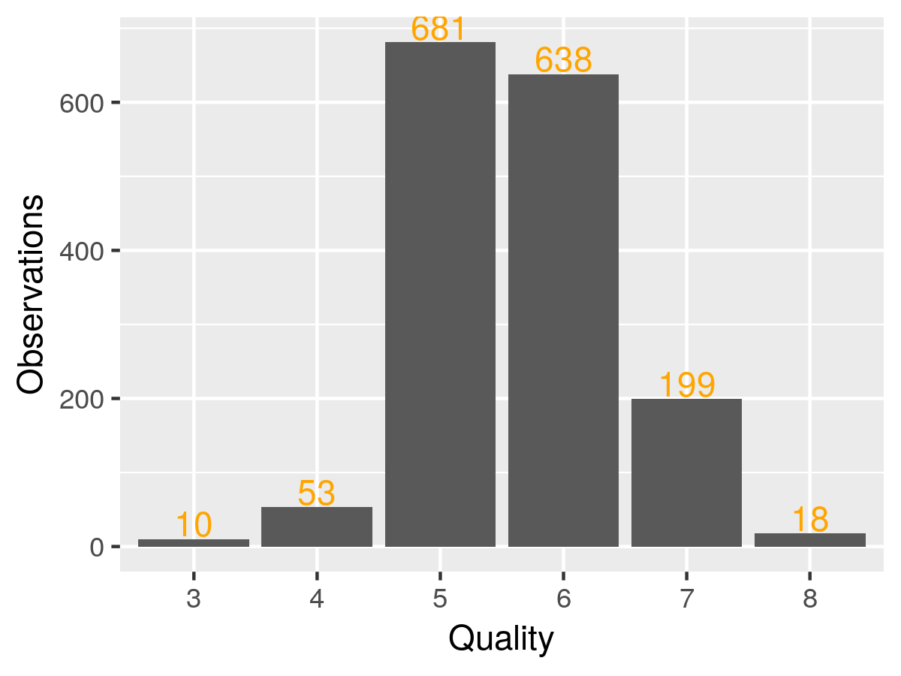</center>
<p style="text-align:center"><b>Figure 1. The bar plot of the number of observations</br> for different wine qualities in the red wine dataset</b></p>
<br>
<center></center>
<p style="text-align:center"><b>Figure 2. The bar plot of the number of observations for</br> different wine qualities in the white wine dataset</b></p>
<br>
These figures clearly show that both datasets are imbalanced. In addition, the wine quality is a numerical variable and it is more meaningful to be converted into a categorical variable before starting the decision tree analysis.

To overcome these problems, some of the values if the quality variables have combined together and the resulting values have been turned into categorical values. To goal was to combine the qualities with a very low number of observations. Two different patterns have been tried for this purpose. Figures 3 and 4 show how this transformation has been done for the first pattern.

<br>
<center>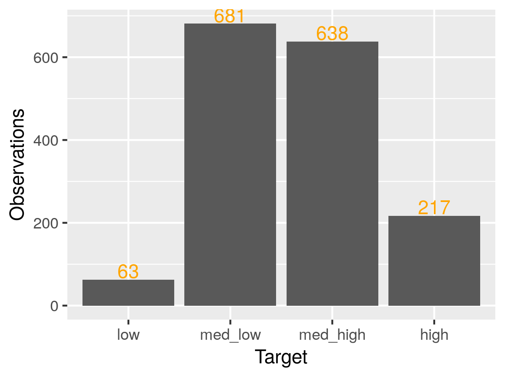</center>
<p style="text-align:center"><b>Figure 3. The bar plot of the number of observations for</br> different wine qualities in the cleaned red wine dataset (pattern 1)</b></p>
<br>
<center>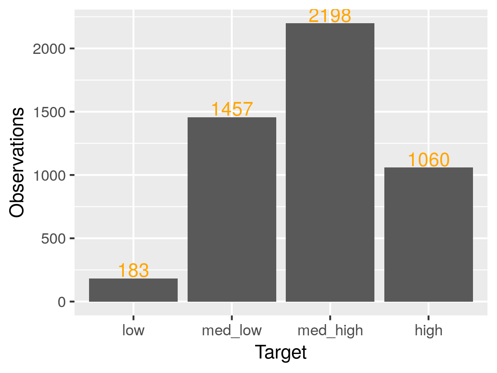</center>
<p style="text-align:center"><b>Figure 4. The bar plot of the number of observations for</br> different wine qualities in the cleaned white wine dataset (pattern 1)</b></p>
<br>
In this pattern, the observations of poor wine qualities of 3 and 4 have been combined into a category of "low" quality to increase the number of observations. Similarly, any good quality equal to or higher than 7 has been converted into a category of "high" quality. The middle quality values of 5 and 6 have been converted into categories of "med-low" and "med-high" respectively.

Figures 5 and 6 show how this transformation has been done in the second pattern.

<br>
<center>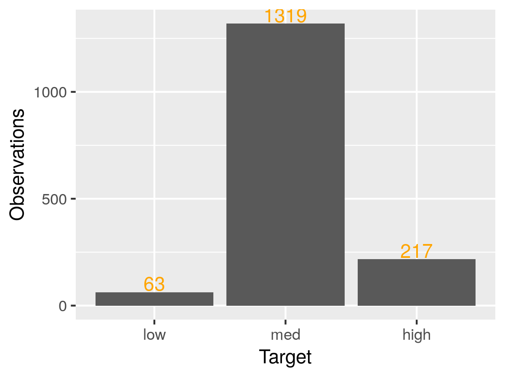</center>
<p style="text-align:center"><b>Figure 5. The bar plot of the number of observations for</br> different wine qualities in the cleaned red wine dataset (pattern 2)</b></p>
<br>
<center>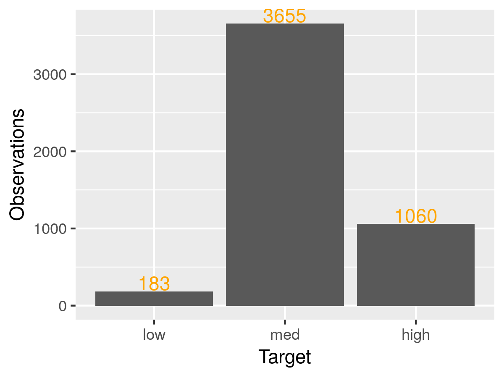</center>
<p style="text-align:center"><b>Figure 6. The bar plot of the number of observations for</br> different wine qualities in the cleaned white wine dataset (pattern 2)</b></p>
<br>
In this pattern, the observations of poor wine with qualities equal or less than 4 have been combined into a category of "low" quality, and any good quality equal or higher than 7 has been converted into a category of "high" quality. The middle quality values of 5 and 6 have been combined into a "med" category. As the figures show these transformations can relieve the imbalance of the observations, but cannot completely remove it.

### Exploratory data analysis
The effect of each wine feature on the quality has been studied using exploratory data visualization of the cleaned datasets. Figure 7 shows the violin and jitter plots of each feature versus red wine quality in the cleaned data (pattern 1). The error bars have been shown too. Figure 8 shows a similar plot for the white wine in the cleaned data (pattern 1).
</br>
<br>
<br>
<center>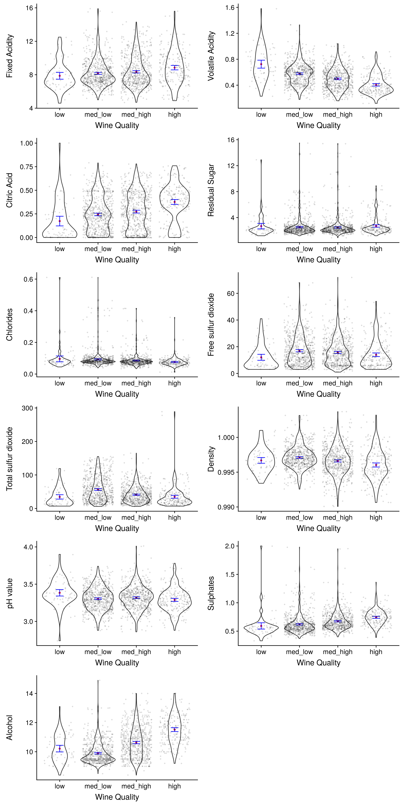</center>
<p style="text-align:center"><b>Figure 7. The violin and jitter plot of each feature versus red wine quality (with error bars)</b></p>
<br>
<center>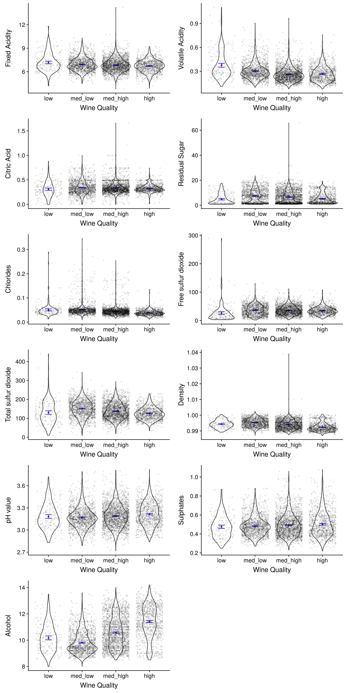</center>
<p style="text-align:center"><b>Figure 8. The violin and jitter plot of each feature versus white wine quality (with error bars)</b></p>
<br>

These figures suggest that alcohol is probably the most important predictor for both red and white wines since the difference between the alcohol value of different qualities is larger than its standard error for both red and white wines. Figure 9 and 10 show the violin and jitter plots of each feature versus the wine quality in the cleaned data (pattern 2) for red and white wines.
<br>
<br>
<br>
<center>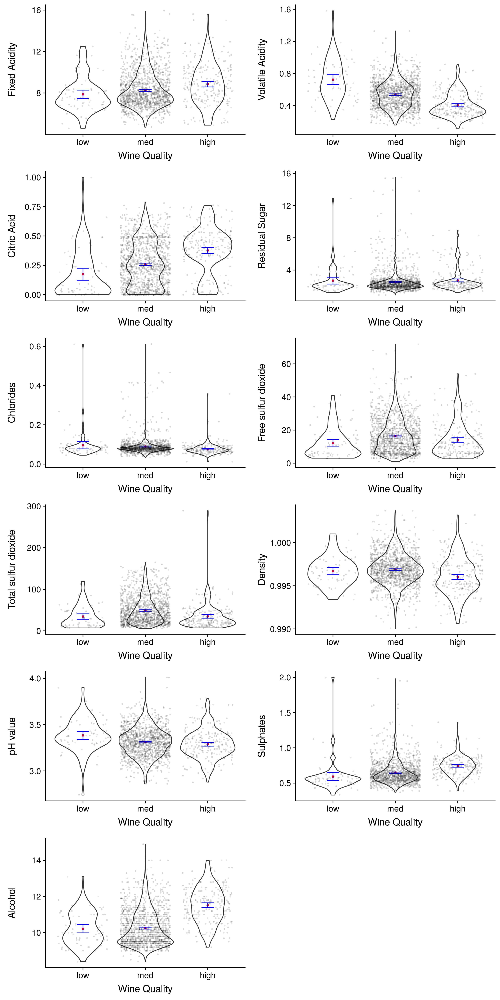</center>
<p style="text-align:center"><b>Figure 9. The violin and jitter plot of each feature versus red wine quality (with error bars)</b></p>
<br>
<center>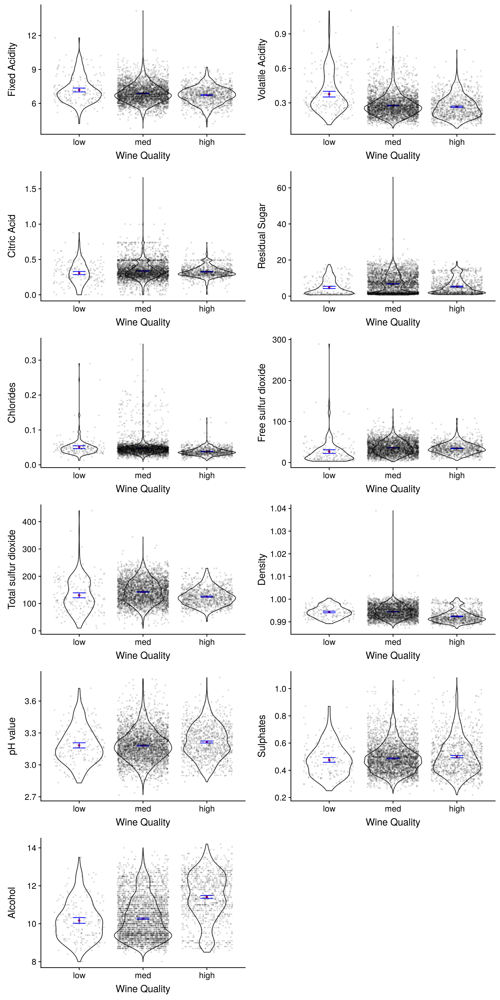</center>
<p style="text-align:center"><b>Figure 10. The violin and jitter plot of each feature versus white wine quality (with error bars)</b></p>
<br>

 In these figures again alcohol looks like an important feature, however, for low and med values the error bars are overlapped for both red and white wines. On the other hand, sulphates looks a little better than alcohol for the red wine.

### Data analysis: Decision tree classifier

In this study, the three top features that affect the wine quality for both the red and white wines should be determined, and a decision tree classifier will be used for this purpose. A decision tree is a classifier that uses a tree-like model for the decisions and their possible outcomes. What makes it useful for this study is that The lesson is it chooses the attributes one at a time, according to some criteria, and it tries to find the best attribute each time, so it allows to rank the predictive features and choose the best ones [[4]](#4).
Since this study only looks for the top three predictors, the tree depth will be set to 3, and this hyperparameter will not be subjected to optimization. However, a 10-fold cross validation with a 90:10 ratio (train: validation) was used to calculate the accuracy of the classifier on the validation sets. Both pattern 1 and 2 for the red and white wine have analyzed using the decision tree classifier. In addition, the scikit learn class_weight attribute has been used to balance the observations. It can automatically adjust some weights inversely proportional to class frequencies in the input data. The analysis has been done with and without balancing the datasets.

Figures 11 and 12 show the decision tree for both red and white wines in pattern 1 without balancing.
<br><br><br>
<center>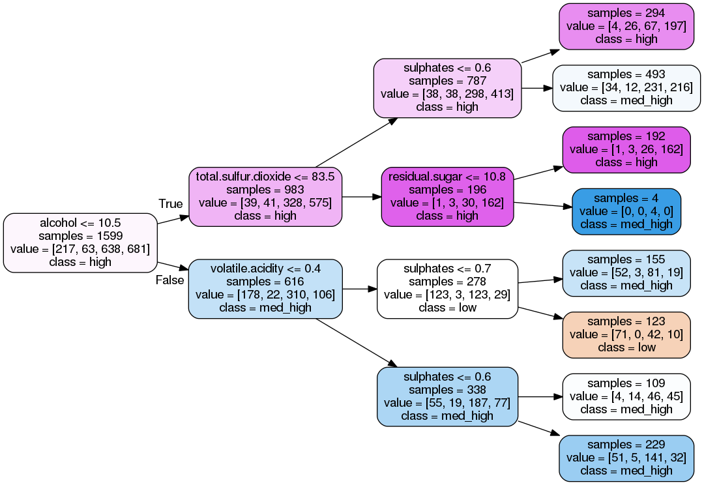</center>
<p style="text-align:center"><b>Figure 11. The decision tree for the red wine (pattern 1) without balancing</b></p>
<br>
<center>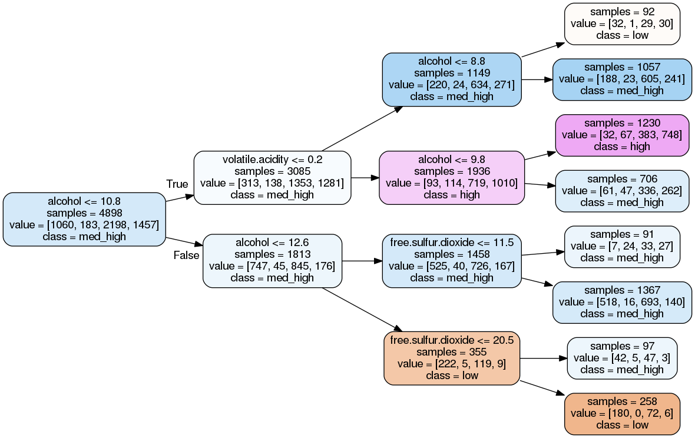</center>
<p style="text-align:center"><b>Figure 12. The decision tree for the white wine (pattern 1) without balancing</b></p>
<br>
Figures 13 and 14 show the decision tree for both red and white wines in pattern 1 with balancing.<br></br>
<br>
<center>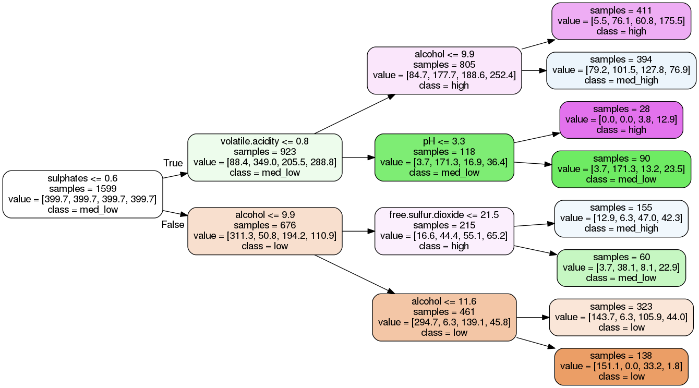</center>
<p style="text-align:center"><b>Figure 13. The decision tree for the red wine (pattern 1) with balancing</b></p>
<br>
<center></center>
<p style="text-align:center"><b>Figure 14. The decision tree for the white wine (pattern 1) with balancing</b></p>
<br>
Figures 15 and 16 show the decision tree for both red and white wines in pattern 2 without balancing.<br></br>
<br>
<center>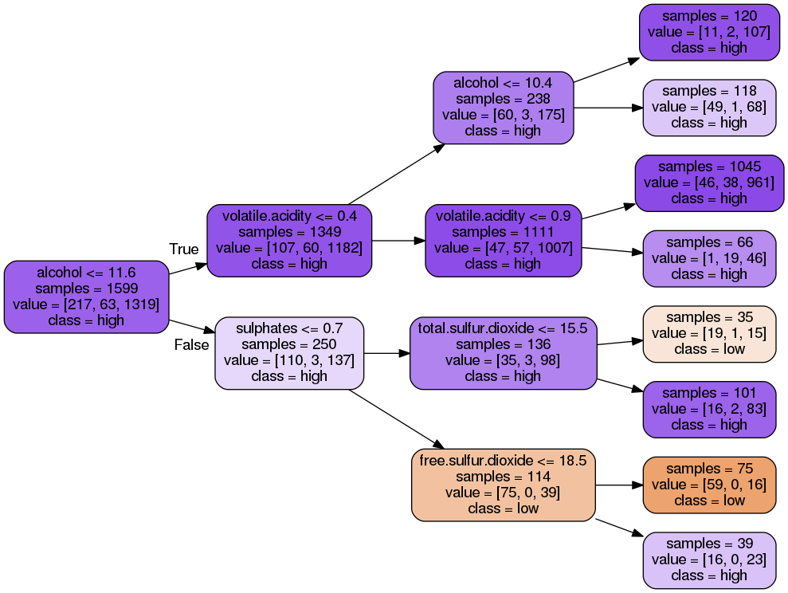</center>
<p style="text-align:center"><b>Figure 15. The decision tree for the red wine (pattern 2) without balancing</b></p>
<br>
<center></center>
<p style="text-align:center"><b>Figure 16. The decision tree for the white wine (pattern 2) without balancing</b></p>
<br>
Figures 17 and 18 show the decision tree for both red and white wines in pattern 2 with balancing.
<br><br><br>
<center>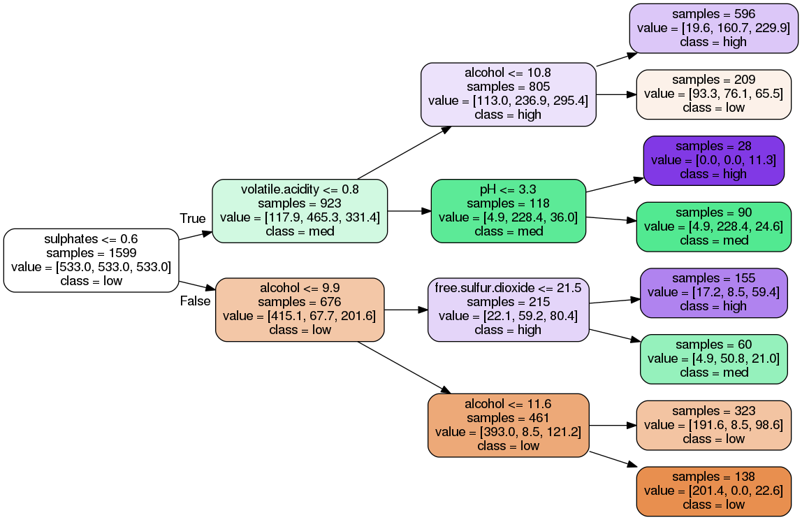</center>
<p style="text-align:center"><b>Figure 17. The decision tree for the red wine (pattern 2) with balancing</b></p>
<br>
<center>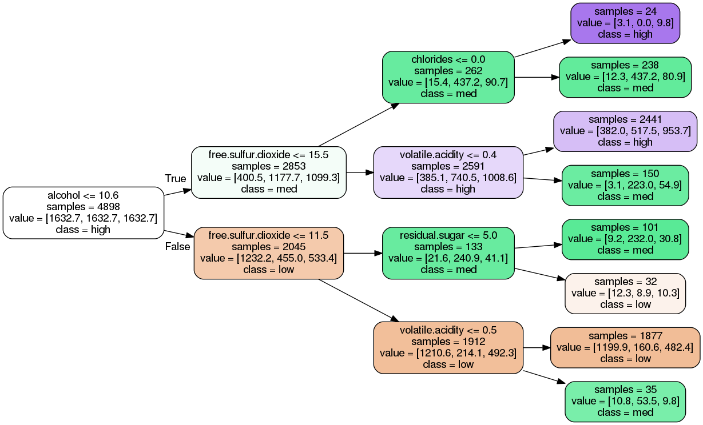</center>
<p style="text-align:center"><b>Figure 18. The decision tree for the white wine (pattern 2) with balancing</b></p>
<br>
<br>


### Results and discussion

Table 1 summarizes all the results of the previous figures. It shows the top three predictors for each tree. The determine the top three predictors, the 'tree.feature_importances_' of DecisionTreeClassifier in scikit learn has been used. It returns the Gini importance of that feature. In addition, it shows the average accuracy of a 10-fold cross validation with 90:10 ratio for train: validation sets.

<br>
<p style="text-align:center"><b>Table 1. A summary of the decision tree analysis</b></p>

<center>
|Cleaning pattern| Wine type | Balancing used in analysis| Accuracy| First top predictor| Second top predictor |Third top predictor|
|---|---|---|---|---|---|---|
|1|Red|No|54%|Alcohol| Sulphates | Total sulfur dioxide|
|1|Red|Yes|47%|Alcohol | Sulphates| Volatile acidity|
|1|White|No|53%|Alcohol| Volatile acidity| Free sulfur dioxide|
|1|White|Yes|46%|Alcohol| Free sulfur dioxide | Volatile acidity|
|2|Red|No|84%|Alcohol| Volatile acidity | Sulphates|
|2|Red|Yes|53%| Sulphates| Alcohol| Volatile acidity|
|2|White|No|75%|Alcohol| Volatile acidity|pH|
|2|White|Yes|57%|Alcohol|Free sulfur dioxide|Volatile acidity|
</center>
</br>

The first thing that can be concluded from this table is that pattern 2 gives higher accuracies than pattern 1. This can be attributed to the way that the features combined. The quality of a wine is assessed and scored by a human taster. In pattern 2 we have low, med and high quality wines. However, in pattern 1 we have two large classes of average wines with the scores of 5 and 6. Distinguishing between a very good wine, a very bad wine, and an average wine is much easier than distinguishing between two average wines, and it is likely that these human taster do not have strict rules to distinguish between these two scores (5 and 6) and simply pick a number for that. So it can be very difficult for the learning algorithm to classify these two classes and it will affect the accuracy.
So it is evident that pattern 2 is a much better way to clean the dataset and it is not a good idea to use a learning algorithm to classify the middle classes based on the scores of a human expert.

It is important to note that only for one case (Pattern 1, red wine with balancing), there was a mismatch between the tree structure and the reported important features. In this case, the alcohol has the highest Gini impact reported by scikit learn, however in the tree structure (Figure 13), sulphates sits at the root of the tree. The reason is that in the tree structure alcohol is used three times to split the nodes, so its total impact is higher than sulphates.

In addition, it seems that when balancing is done, both patterns 1 and 2 give the same order of predictors for the red and wine wines.

It seems that balancing the data set in scikit-learn decreases the accuracy. This can be attributed to the fact that without proper weighting of the less abundant target categories, the algorithm can get a higher score with labeling most of the examples with more abundant target categories and ignoring the less abundant ones at a lower cost.

Finally, we pick the three top predictors from the decision analysis of pattern 2 with balancing. For red wines, they are sulphates, alcohol, and volatile acidity respectively. For white wines, they are alcohol, free sulfur dioxide, and	volatile acidity. These results are consistent with the exploratory data analysis results mentioned before. So Alcohol and volatile acidity are the common important features for both red and white wines.

#### References

<a name="1"></a> [1] [Wine Quality Data Set](https://archive.ics.uci.edu/ml/datasets/Wine+Quality), UCI Machine Learning Repository.</br>
<a name="2"></a>[2] P. Cortez, from University of Minho, Guimarães, Portugal (http://www3.dsi.uminho.pt/pcortez).</br>
<a name="3"></a> [3] P. Cortez at al., "Modeling wine preferences by data mining from physicochemical properties", *Decision Support Systems* 47 (**2009**) 547-533.</br>
<a name="4"></a> [4] M. Kubat, An Introduction to Machine Learning, Springer International Publishing, **2015**.<br/>
