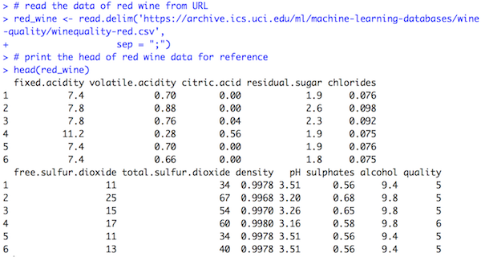

# DSCI 522 Project: Wine Quality Predictors

### Team Members
- Reza Bagheri (github ID: reza-bagheri)
- Luo Yang (github ID: lyiris22)

### Dataset

In this project, we have used the [Wine Quality Data Set](https://archive.ics.uci.edu/ml/datasets/Wine+Quality) available from [UCI Machine Learning Repository: Data Sets](https://archive.ics.uci.edu/ml/datasets.html). The source of these data sets is [Paulo Cortez](http://www3.dsi.uminho.pt/pcortez) from University of Minho, Guimarães, Portugal.

The two datasets are related to red and white variants of the Portuguese "Vinho Verde" wine. The physicochemical (inputs) and sensory (the output) variables are available in these datasets. There are 12 attributes and 4898 instances in total.

Input variables include fixed acidity, volatile acidity, citric acid, residual sugar, chlorides, free sulfur dioxide, total sulfur dioxide, density, pH, sulphates and alcohol. The output variable is quality (score between 0 and 10).

We have used a R script [load_data.R](/src/load_data.R) to load the data from URL. Below are some outputs from the script:

### Proposal
The question:
##### what are the top three predictors for the wine quality?

 This question is **predictive**.

In our project, we are going to find the three top input variables that affect the wine quality for both the red and white wines. We will use a decision tree analysis for the physicochemical data (as inputs) and the wine quality (as the output) to determine the three top predictors. The three top predictors will be the closest rule stumps to the tree root. We will do this analysis on both the red and white wine datasets.

Since the outcome of wine are integers, we combine the quality number into 3 or 4 targets. In the 3 targets case, the categories are "low", "med" and "high". In the 4 targets case, the categories are "low", "med_low", "med_high" and "high". We try both ways to determine which is better for fitting our decision tree.

To show the result of our analysis, we will display the pictures of decision trees. The red wine set and white wine set will be evaluated separately. The three top input variables for each dataset will also be listed. To display the results of the decision tree, we will draw the top layers of the tree.

The classes in our dataset are ordered and not balanced (e.g. there are much more normal wines than excellent or poor ones). So if we find out that there is a large imbalance in there, we may try to balance it out. In the DecisionTreeClassifier in [scikit-learn](https://scikit-learn.org/stable/modules/generated/sklearn.tree.DecisionTreeClassifier.html), there is a hyper-parameter `class_weight` that we can set it to `balanced` to balance our data.
